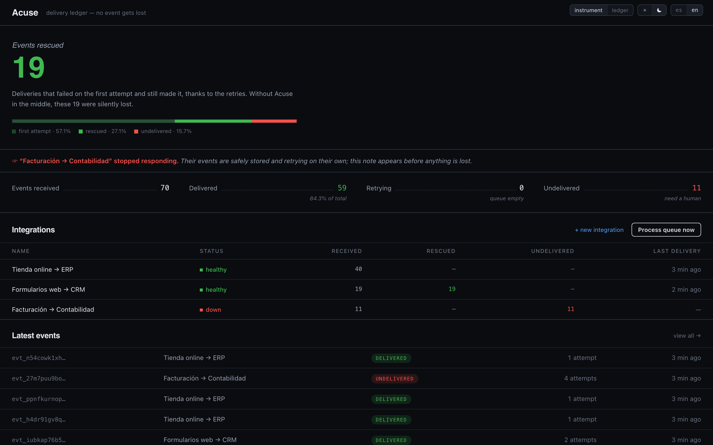
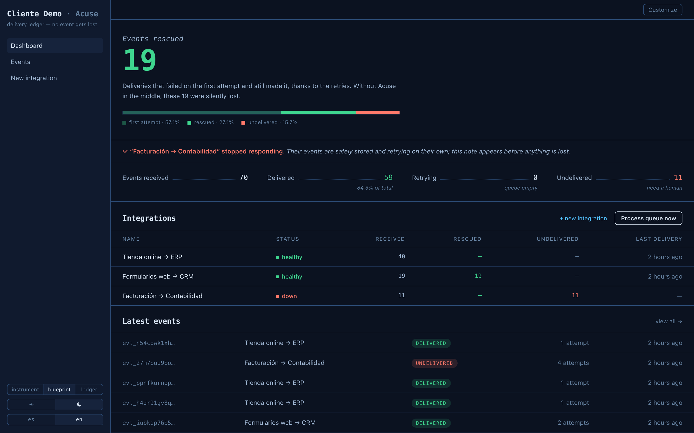
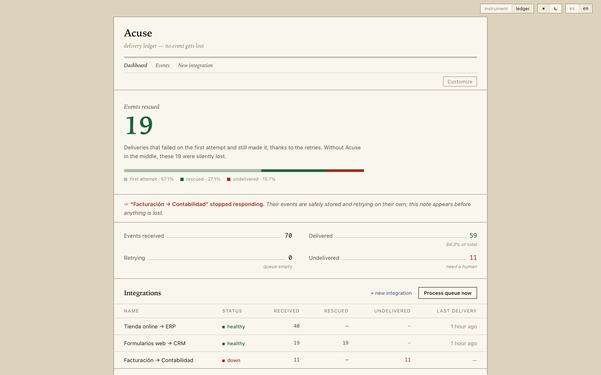

# Acuse

**Self-hosted webhook gateway: no event gets lost.**

[](https://github.com/malenitaa/acuse/actions/workflows/ci.yml)
[](LICENSE)

Acuse sits between the systems that emit webhooks and the systems that must receive them.
Every event is persisted before the sender gets an answer, failed deliveries are retried
automatically with exponential backoff, exhausted ones land in a dead-letter state with
one-click replay, and a dashboard shows the number that matters: **how many deliveries
were rescued** that would otherwise have been silently lost.

*Acuse* is short for *acuse de recibo*, Spanish for acknowledgment of receipt. The UI
speaks English and Spanish; the whole thing runs on your own infrastructure with one
`docker compose up`.



<details>
<summary><strong>Same product, other personalities: «plano» and «ledger»</strong></summary>





</details>

## The problem

Companies wire their online store to an ERP, web forms to a CRM, billing to accounting.
Each connection is a URL receiving webhooks. When a destination is down for two minutes
(a restart, a deploy, a provider hiccup), those webhooks don't come back: the sender
retries a few times, gives up, and discards them. The failure is silent. The sale never
gets invoiced, the lead never reaches the CRM, and nobody notices until a customer
complains days later.

## What you get

- **Durable ingestion**: events are written to Postgres *before* the sender is answered.
  From that point on they cannot be lost, even if the destination is down for a day.
- **Automatic retries**: exponential backoff with jitter: 5s, 15s, 45s, 2m, 7m, 20m, 1h.
- **Early failure detection**: an integration that stops responding is flagged on the
  dashboard while its events are still being retried, before anything is lost.
- **Dead-letter queue with replay**: original payloads are kept, so any event, including
  exhausted ones, can be redelivered with one click.
- **Full delivery audit trail**: every attempt is recorded with timestamp, status code,
  response body and duration.
- **Compose and schedule events**: send a test event to any integration from the
  console, or queue one for later ("this must go out at 2 am; I want to sleep"). A
  scheduled send is simply an event whose delivery time hasn't arrived yet, so the
  same queue, the same retries and the same audit trail apply.
- **Retention that never deletes**: by default everything is kept forever. With
  `RETENTION_DAYS` set, delivered events older than that are *archived*: out of the
  operational lists, but browsable under the **Archive** filter and restorable with one
  click. Undelivered events never leave the operational view on their own.
- **Signed deliveries, [Standard Webhooks](https://www.standardwebhooks.com) compliant**:
  every request carries `webhook-id`, `webhook-timestamp` and
  `webhook-signature: v1,<base64>` (HMAC-SHA256 over `id.timestamp.body`), so
  destinations can verify origin and reject replays using any Standard Webhooks
  library, Svix's SDKs included.
- **Failure alerts as webhooks**: set `ALERT_WEBHOOK_URL` and every event that exhausts
  its retries POSTs a JSON alert there. Point it at a chat webhook, an automation-platform trigger, or
  even another Acuse: delivery failures become one more event your tools can route.
- **Three themes × light/dark**: a sidebar ops console («instrument»), a drafting-table
  blueprint («plano»), or a paper ledger («libro»), each in light and dark, following
  your system preference. Bilingual
  UI (English / Spanish). Choices are remembered.

## Run it on your own server (recommended)

All you need is [Docker](https://www.docker.com/products/docker-desktop/). One command
brings up the app, its Postgres database and the retry worker. No external scheduler,
no platform account, and your webhook data never leaves your network:

```bash
git clone https://github.com/malenitaa/acuse.git
cd acuse
docker compose up -d
```

The console is at `http://localhost:3000` (or your server's IP). Data survives restarts
in a Docker volume; `docker compose down` stops everything.

**→ Five-minute guided tour, rescue included: [docs/QUICKSTART.md](docs/QUICKSTART.md)**

- First boot builds the image (a few minutes); after that it starts in seconds.
- Create integrations from the console (**+ new integration**): give it a name and the
  destination URL, and Acuse hands you the ingest URL to paste into the emitting system
  (your online store, your CRM, your automation platform, a form backend…) in place of the direct destination.
- To expose it beyond your network, put a domain with HTTPS in front (Caddy, nginx);
  for internal use, the IP is enough.

<details>
<summary><strong>Deploy to Vercel instead</strong></summary>

If you'd rather not run a server: fork this repo, create a Postgres database
([Neon](https://neon.tech) free tier works), run [`db/schema.sql`](db/schema.sql) in its
SQL editor, then import the fork in Vercel with two environment variables:

- `DATABASE_URL`: the Neon connection string.
- `CRON_SECRET`: a long random string protecting the retry worker.

The retry schedule ships in [`vercel.json`](vercel.json) (Vercel Cron hits `/api/cron`
every minute). On serverless the embedded worker stays off; the platform's cron does
the ticking.

</details>

## Using it

1. **Create an integration** (*+ new integration* on the dashboard): a name and the
   destination URL where events must be delivered.
2. **Paste the ingest URL** Acuse gives you into the system that emits the webhooks
   (your online store, your CRM, your automation platform, a form backend…), in place of the direct destination.
3. **Read the dashboard**: health per integration, every event with its full attempt
   trail, and one-click replay for anything that exhausted its retries.

Two patterns worth knowing:

- **Instrument both edges of a workflow.** Acuse cannot see inside a workflow engine
  (internal steps are synchronous calls; that's what the engine's own run log is for),
  but it can watch the edges: one integration for the trigger going *in*, and, as the
  workflow's final step, an HTTP call to a second integration marking *done*. If "in"
  says 40 and "done" says 37, three runs died inside, and you know exactly which ones.
- **Route failures to your tools.** With `ALERT_WEBHOOK_URL` set, exhausted events POST
  a JSON alert wherever you point it: a chat webhook, an automation error-workflow,
  or another Acuse.

## Security

- **Optional console lock**: set `CONSOLE_PASSWORD` and the dashboard requires HTTP
  Basic Auth (the ingest endpoint stays public by design; that's where webhooks
  arrive). Without it the console is open: fine for a laptop demo, not for an exposed
  deployment.
- **Signed outbound deliveries** implementing the
  [Standard Webhooks](https://www.standardwebhooks.com) spec (HMAC-SHA256 over
  `id.timestamp.body`, `whsec_` secrets, anti-replay tolerance window), verifiable
  with any compliant library, or with the `verifySignature` helper in
  [`src/lib/signature.ts`](src/lib/signature.ts).
- **Rate-limited ingestion** (per-key, 600 req/min by default, `429 + Retry-After`,
  configurable via `INGEST_MAX_PER_MINUTE`).
- **Destination guard**: only `http(s)` destinations; set `BLOCK_PRIVATE_DESTINATIONS=1`
  to refuse loopback/private/link-local addresses if untrusted operators can create
  endpoints (SSRF hardening).
- **Baseline security headers** (`nosniff`, `X-Frame-Options: DENY`, referrer and
  permissions policies), constant-time secret comparisons, 1 MB body cap.
- Zero `npm audit` vulnerabilities at the time of writing; CI runs typecheck + build on
  every push.

## How it works

```
   Store    ─┐
 Web forms  ─┼──▶  POST /api/i/<key>  ──▶  [ Postgres ]  ──▶  worker  ──▶  destination
   Billing  ─┘        (202, fast)           events +          (30s tick
                                            attempts           or cron)
```

Design decisions worth reading in the code:

- Ingestion never delivers inline: one `INSERT`, then respond. Making the sender wait
  on a third party is how events get dropped.
- Workers claim events with `FOR UPDATE SKIP LOCKED`, so several can run in parallel
  without double-sending. The embedded worker (`EMBEDDED_WORKER=1`, default in Docker)
  ticks inside the app process; on Vercel, platform cron does it.
- The attempt record is written before the event outcome. If the process dies
  mid-delivery, the lease expires and the event is retried: a duplicate is recoverable,
  a silent loss is not.
- Retry jitter prevents a recovered destination from being knocked down again by a
  simultaneous burst of queued events.
- Endpoint health is derived from the queue rather than from heartbeats: a broken
  integration reveals itself because events pile up behind it.

Stack: Next.js 16, React 19, Tailwind 4 (design tokens, container queries, zero UI
libraries), Postgres via `pg`. Single-tenant by design.

<details>
<summary><strong>Local development</strong></summary>

Requires Node 20+ and Postgres.

```bash
createdb acuse
cp .env.example .env.local   # set DATABASE_URL
npm install
npm run db:reset             # create the schema
npm run seed                 # three sample integrations
npm run dev
```

Generate realistic traffic against the samples (one healthy destination, one that fails
and recovers, producing the rescued count, and one that's down):

```bash
npm run simulate -- --events=70 --seconds=140
```

Unit tests cover the core guarantees (backoff bounds and schedule, HMAC signing and
verification, destination guarding, rate limiting, and i18n parity) using Node's
built-in test runner, with zero extra dependencies:

```bash
npm test
```

</details>

## FAQ

**What does it cost to run?** Your own hardware, or free tiers (Vercel + Neon) for
small/medium volume.

**Are events lost if Acuse restarts?** No: every event is persisted before the sender
gets a response. From there it can only be delivered or parked, never dropped.

**What if a destination is down for a whole day?** Retries continue with growing waits
until attempts are exhausted; the event is then marked undelivered, kept forever, and
can be replayed with one click.

**Does it work with any system?** Anything that sends webhooks (HTTP calls) can point at
Acuse, and anything that accepts HTTP can be a destination.

**Does Acuse ever delete old events?** Never; deleting would betray the whole point.
Retention archives instead: old delivered events move out of the way but stay browsable
and restorable, forever. Your disk is the only limit.

**How does it compare to Svix or Hookdeck?** Those are excellent commercial products for
this category at scale. Acuse is the small, readable, self-hosted take: one container,
one Postgres, no accounts, MIT license.

## Author

Built by [**Malena**](https://github.com/malenitaa).

## Enjoyed it?

If this was useful and you'd like to support the project:

- [Cafecito](https://cafecito.app/rezamalena)
- [Ko-fi](https://ko-fi.com/malenitaa)

## License

MIT. See [LICENSE](LICENSE).
