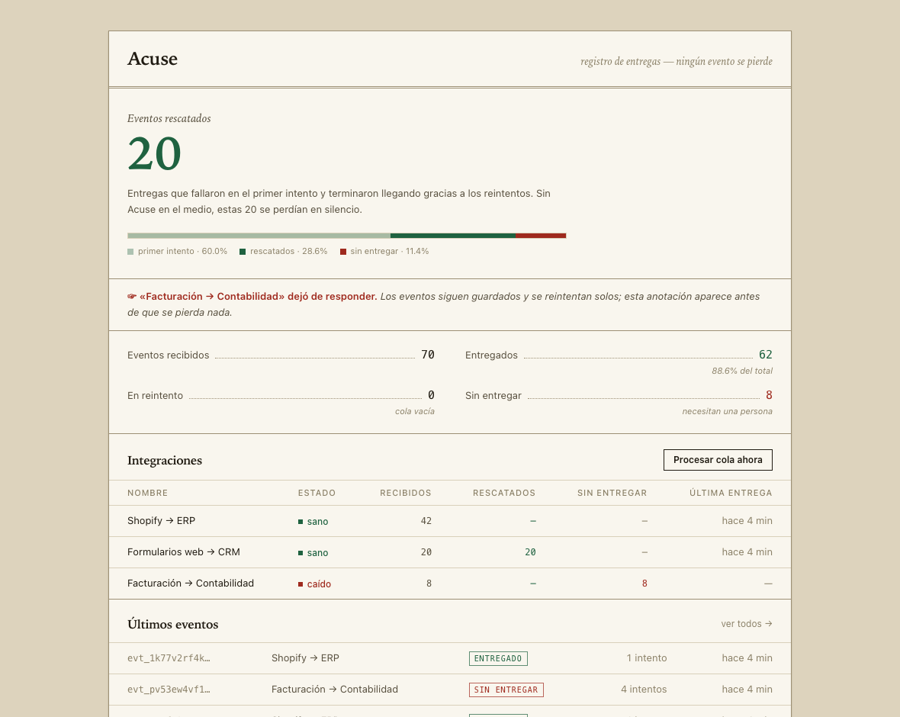

# Acuse

**A webhook delivery guardian: no event gets lost.** Acuse sits between whoever sends a
webhook and the system that must receive it. It stores every event before answering,
retries failed deliveries automatically, and shows you exactly how many it rescued.



> **¿Poco técnico? Leelo en criollo:** cuando dos sistemas se conectan (tu tienda con tu
> facturación, un formulario con tu CRM), se avisan las cosas con mensajes automáticos. Si el
> que recibe está caído dos minutos, esos mensajes **se pierden y nadie se entera**: la factura
> no se emite, el cliente no entra al CRM. Acuse es un contestador terco que se pone en el
> medio: anota todo antes que nada, insiste hasta entregar, y te muestra en un panel cuántos
> mensajes salvó y cuáles necesitan una mano.

## The problem

A company wires Shopify to its ERP, its web forms to a CRM, its billing to accounting. Each
connection is a URL receiving webhooks. When the destination is down for two minutes, those
webhooks **don't come back** — the sender retries a couple of times, gives up, and discards
them. Nobody notices until a customer complains days later.

The expensive part is not the two-minute outage. It's that it was **silent**.

## What Acuse does

1. **Receive and persist.** The event is written to Postgres before the sender gets its
   response. From that point on it cannot be lost, even if the destination is dead.
2. **Retry on its own.** Exponential backoff with jitter: 5s, 15s, 45s, 2m, 7m, 20m, 1h.
3. **Warn before it hurts.** An integration that stops responding shows up red while its
   events are still being retried — not after they're gone.
4. **Replay by hand.** The original payload is kept, so "resend" is a button that works.
5. **Show the number.** How many deliveries failed on the first attempt and landed anyway.
   That figure is the product's entire reason to exist, measured.

## How it works

```
   Shopify ─┐
 Web forms ─┼──▶  POST /api/i/<key>  ──▶  [ Postgres ]  ──▶  worker  ──▶  customer's
   Billing ─┘        (202, fast)           events +          (cron)       destination
                                           attempts
```

Design decisions worth reading in the code:

- **Ingest never delivers inline** — one `INSERT`, then respond. Making the sender wait on a
  third party is exactly how events get dropped.
- **Workers claim events with `for update skip locked`**, so several can run in parallel
  without ever double-sending.
- **The attempt is recorded before the outcome** — if the process dies mid-delivery, the
  lease expires and the event is retried. A duplicate is recoverable; a silent loss is not.
- **Jitter is not decoration** — when a destination comes back up, un-jittered retries would
  all fire at once and knock it down again.
- **Outgoing deliveries are signed** (`t=…,v1=HMAC-SHA256(t.body)`, Stripe-style) so the
  destination can verify origin and reject replays.
- **Health is derived from the queue**, not from heartbeats: a broken integration reveals
  itself because events pile up behind it.

## Run it

You need Node 20+ and Postgres.

```bash
createdb acuse
cp .env.example .env.local   # fill in DATABASE_URL
npm install
npm run db:reset             # creates the tables
npm run seed                 # 3 sample integrations
npm run dev
```

Then, in another terminal, generate believable traffic and watch the dashboard:

```bash
npm run simulate -- --events=70 --seconds=140
```

The three sample integrations cover the three states that matter: one healthy, one that
fails and recovers (that one produces the rescued number), and one that is down.

## Deploy

Runs on Vercel with any managed Postgres (Neon, Supabase, Vercel Postgres). The worker is an
HTTP route, so schedule it with Vercel Cron and set `CRON_SECRET`:

```json
{ "crons": [{ "path": "/api/cron", "schedule": "* * * * *" }] }
```

## Status: v1, single-tenant, eyes open

This is a working v1 that favors honesty over feature count:

- **No accounts and no login.** Anyone who can reach the console can operate it. Deploy it
  for yourself, behind your own protection — it is not multi-tenant SaaS yet.
- **Alerts live on the panel** — no email/Slack notifications yet.
- **Retries are floor-limited by the cron cadence** (1 minute on Vercel).
- **No retention policy** — events are kept forever.
- UI is in Spanish for now.

If you need this at company scale today, that category exists commercially (Svix, Hookdeck).
Acuse is a small, self-hosted, readable take on the same problem.

## Enjoyed it?

If this was useful and you'd like to support the project:

- [Cafecito](https://cafecito.app/rezamalena)
- [Ko-fi](https://ko-fi.com/malenitaa)

## License

MIT — see [LICENSE](LICENSE).
